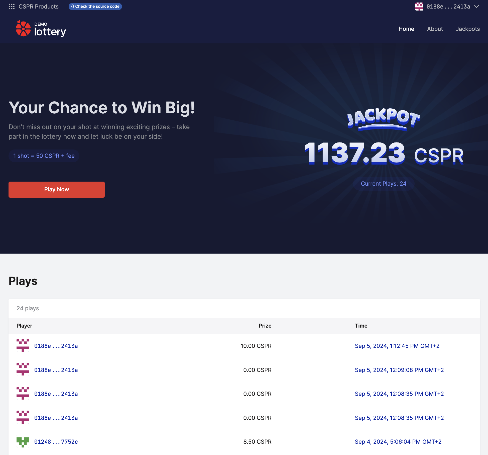
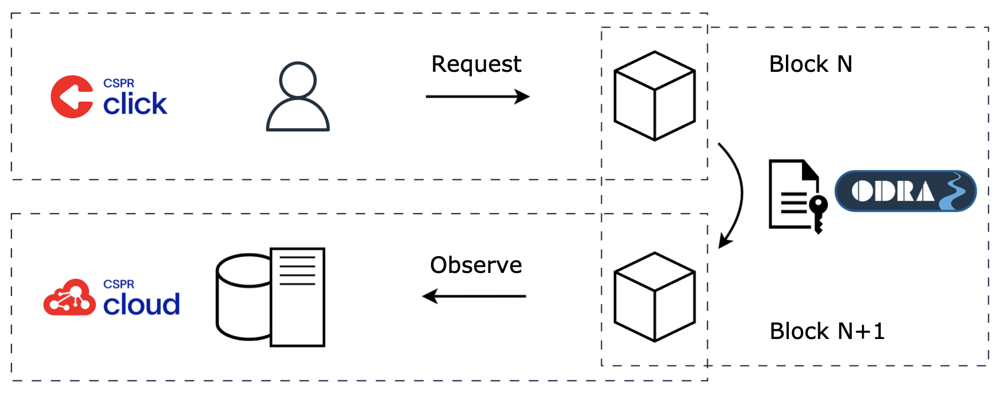
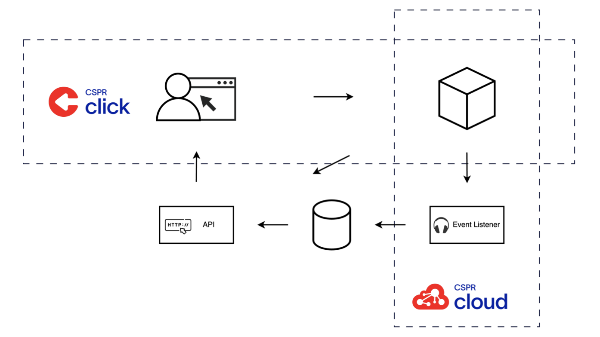

# Lottery Demo dApp

This is an example of a decentralized application (or dApp) built on the [Casper Network](https://casper.network), a layer 1 proof-of-stake (PoS) blockchain. Lottery game logic implemented on-chain aims to demonstrate the value of blockchain, which is the increased trust to the outcome since nobody can manipulate the results.

To participate in the lottery, you need to buy a ticket using the Casper Network native token. After collecting a fee, the application puts the proceeds into the prize pool, which is used to reward the players. When somebody wins the jackpot, a new lottery round starts, making the game indefinite. 

You can try it by playing the lottery deployed to [Casper Testnet](https://testnet.cspr.live/) at https://lottery-demo.casper.network. Please use the [Faucet](https://testnet.cspr.live/tools/faucet) to obtain the test tokens.



## Toolset

This application was created to onboard software engineers to the Casper blockchain and the Web3 architecture in general. Unlike traditional Web2 applications, in Web3, users may interact with blockchain directly. It changes the traditional paradigm of how information flows between users and the application and forces the application to observe the network activity and react correspondingly.

To ease the integration, this example was developed with the help of higher-level abstractions that address those specific challenges of Web3 development and elevate the developer experience.



- [CSPR.click](https://docs.cspr.click) is a Web3 authentication layer that covers the end-user interaction with the blockchain. It provides integration with all the wallets in the Casper Ecosystem and greets users with a well-known Single-Sign-On like experience
- [Odra](https://odra.dev/docs/) is a smart contract framework written in Rust that abstracts the chain-specific details behind a familiar OOP interface
- [CSPR.cloud](https://docs.cspr.cloud) is a middleware layer for the Casper Network. It observes and indexes the network activity and provides access to it via a scalable REST API and real-time WebSocket subscriptions

## Architecture

Lottery Demo is a Web that consists of four primary components interacting with each other:

- [Smart Contract](smart-contract) runs on the Casper Network and implements the lottery logic
- [Event Listener](server/src/event-handler.ts) listens to the contract on-chain activity and aggregates it to the database for faster access via the API  
- [API](server/src/api.ts) reads aggregated on-chain data and serves it to the Web Client. It also acts as a proxy to the CSPR.cloud APIs to make it possible for the Web Client to access CSPR.cloud without exposing the access key
- [Web Client](client) allows users to play the lottery by directly calling the smart contract and displaying information about past plays. It fetches the lottery data from the API and general blockchain data (e.g. account balance) from CSPR.cloud via the CSPR.cloud proxy endpoints exposed by the API



Each component's code resides in a corresponding separate directory of this mono-repository. [Event Listener](server/src/event-handler.ts) and [API](server/src/api.ts) are both parts of the [server](server) infrastructure.

## Setup

To configure you local environment perform the following steps:

1. Register a free [CSPR.build](https://console.cspr.build) account to create CSPR.click and CSPR.cloud access keys.
2. Build and deploy the smart contract to [Casper Testnet](https://testnet.cspr.live) as described [here](smart-contract/README.md). You can skip this step and use the existing [Testnet smart contract](https://testnet.cspr.live/contract-package/8efc85466cf4054f47eb009b683b611fa63cccd14f074bf78f1e9404dc52a347) package hash `8efc85466cf4054f47eb009b683b611fa63cccd14f074bf78f1e9404dc52a347`.
2. Update Web Client configuration as described [here](client/README.md#setup)
3. Update Server configuration as described [here](server/README.md#setup)

## Run Demo

```bash
make run-demo
```

## Run for local development

### Server side

Go to the server folder and proceed according to the instructions (`cd client`)

[Server side setup instructions](./server/README.md)

### Client side

Go to the client folder and proceed (`cd client`)

[Client side setup instructions](./client/README.md)

## About Casper

[Casper](https://casper.network) is a layer 1 proof-of-stake (PoS) blockchain that prioritizes security and decentralization. Casper was built with developer needs in mind and supports features such as upgradable smart contracts or multi-signature transactions on the protocol level. Casper smart contracts are run in a WASM virtual machine, creating the possibility of using a wider variety of languages for smart contract development.

Join [Casper Developers](https://t.me/CSPRDevelopers) Telegram channel to connect with other developers.
