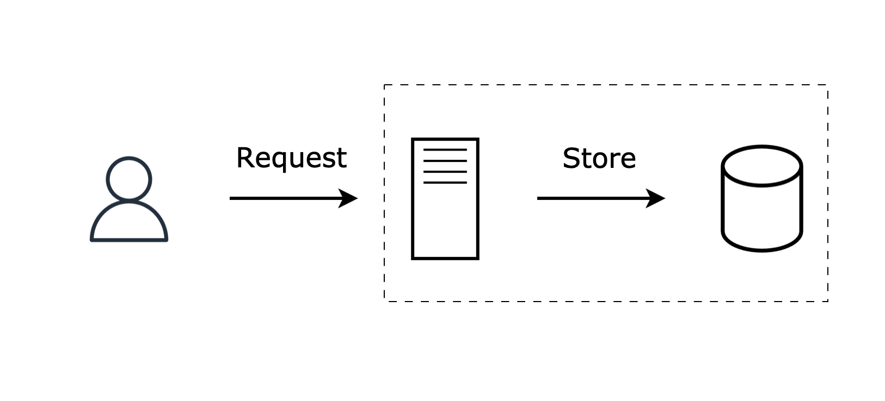
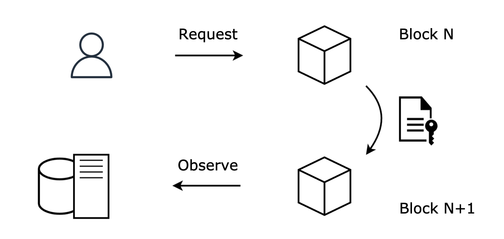
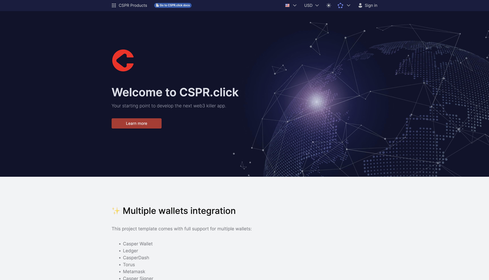

# PWB Example dApp

Created: March 15, 2024

## Casper example dApp

### Background

Despite being around for 15 years, blockchain is still considered a new technology, and here, “new” really means “unknown.” Businesses and the developer community still misunderstand blockchain. While it’s easy to build the narrative for the product value of blockchain, which is trust in the information coming from it, onboarding developers requires more effort. 

Considering that one of the favorite learning methods for developers nowadays is learning by example, we want to develop an example of a functioning dApp, that covers all the aspects of the blockchain integration, and not only the smart contract part. We want this example to teach developers the main concepts instead of relying on white-label templates (e.g. NFT galleries or meme coins).

The example should highlight the shift in the information flow that happens in Web3 applications compared to “traditional” Web2 ones, where the end-users, by design, don’t have access and control over their data. In Web2, the application controls the data storage, and thus the data:

The blockchain challenges the status quo of this approach and introduces a new way of managing the data that gives control to the users:

Instead of relying on the application as the middle-man, the users interact with the blockchain directly, resulting in a three-piece architecture:

1. Client application that provides an interface to interact with the blockchain and reads the data from the blockchain directly or from the server-side API
2. Smart contracts, which are on-chain logic that processes user requests in a trustful and predictable way
3. Server-side that observes the on-chain activity and reacts to it accordingly by triggering the related pipelines, aggregating the data for the end-users, etc. The server side typically consists of the on-chain activity handler application and the API

Casper Ecosystem contains tools that simplify blockchain integration on all of those layers to the point where developers with little to no prior Web3 experience can relatively quickly onboard into the space, and we want to leverage those instruments in the Example dApp:

1. [CSPR.click](http://CSPR.click) is a Web3 authentication layer that provides:
    1. Integration with all wallets in the Casper Ecosystem
    2. Access to all fiat on-ramps in the Casper Ecosystem
    3. And most importantly, familiarity to everybody with a Single-Sign-On approach that ensures a seamless user onboarding experience
2. Odra is a smart contract framework written in Rust that abstracts the chain-specific details behind a familiar OOP-like interface
3. [CSPR.cloud](http://CSPR.cloud) is a middleware layer that observes on-chain activity and provides:
    1. Access to indexed and normalized blockchain data via REST API
    2. Realtime WebSocket streams that provide a granular subscription to the data required by the dApp
    3. Access to the Casper Node RPC API

With Odra, CSPR.click, and [CSPR.cloud](http://CSPR.cloud), we can prepare an example dApp that teaches developers this new Web3 architecture without overwhelming them with the lower-level details that would delay their onboarding into the blockchain. 

### Application

The application should be simple and easy to understand while highlighting the value of blockchain. For example, a To-do application, which is a common example for front-end frameworks, will not work here. Implementing a To-do application on a blockchain will not increase its value. A lottery, on the other hand, will benefit from blockchain as it increases trust in the fairness of the process. Taking into account that everybody is familiar with the concept and requires no additional introduction, we’ll use it for our example.

The application will allow users to play the lottery by buying a ticket that gives them a chance to instantly win the jackpot, a small consolation prize, or win nothing. With each unsuccessful play, the jackpot increases by the ticket price minus the lottery fee. The blockchain will make the lottery process transparent and immune to manipulations.

The application should be Web-based and work on both desktop and mobile. 

The “Home” page will be divided into two sections:

1. Play section
Will be managing the users’ play experience
2. Plays section
Will be displaying the plays in the current jackpot round

The “Play” section will have four states:

1. Onboarding state
Will be inviting users to connect a Casper wallet
2. Play state
Will be inviting users with connected accounts to play 
3. Waiting state
Will be displaying a loading indicator for users waiting for the results of their play
4. Result state
Will be notifying users about the results of their play

To demonstrate a typical use case of indexing the on-chain data on the application side, we’ll add two more pages:

1. Jackpots page
Will be accessible from the top navigation menu and will display information about past jackpots
2. Plays page
Will be accessible from:
    1. “My plays” top navigation menu and will display plays made by the currently connected account
    2. “Jackpots” page and will display plays for the selected jackpot

Considering that we may want to deploy this application under a public URL, we should add the “About” page explaining the application's demo purposes with links to Odra, CSPR.click, CSPR.cloud, and Casper Network documentation pages.

Each play payment will contribute to three “buckets”:

1. Current jackpot amount
2. Next jackpot starting amount
3. Application fee

This logic will be handled by the smart contract, which will also allow you to configure the ratios and provide a possibility to transfer the application fees outside of the contract.

### Technical details

The client application should be React-based and bootstrapped from the [CSPR.click React template](https://www.npmjs.com/package/@make-software/cra-template-csprclick-react):

We should reuse as much of the existing UI elements provided in the template application as possible. The top navigation menu should be limited only to featured “CSPR Products”, custom “About” and “Jackpots” links, and the standard “Account” menu. The language, currency, network, and theme selectors should be omitted.

The jackpot and plays data will be aggregated by the Event Handler application from the contract-level events to be served to the Client application via the API. To keep the application simpler, we’ll denormalize jackpots and plays into one entity containing the following properties:

- `round_id`
- `play_id`
- `player_account_hash`
- `prize_amount`
- `is_jackpot`

This way, the application state management will be simpler.

## Tickets

All tickets are maintained in the Github project for this repo at https://github.com/casper-ecosystem/pbw-2024-workshop/issues

Tickets not yet entered into the Github system are kept in the tickets subfolder. Master list is [here](./tickets/tickets-all.md)

